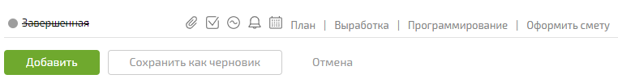

Юзерскрипт для быстрой простановки аналитик выработки и оформления смет.

## Возможности
- быстрое добавление аналитики, минуя выбор словаря и типа работ
- аналитика сохраняется по нажатию Enter в поле кол-ва минут
- [быстрое оформление смет](https://tagilcity.planfix.ru/task/604890)
- сортировка аналитик в смете
- текстовые шаблоны в комментариях
- убирание спойлеров у комментариев и описаний задач

## Установка
1. Поставьте Tampermonkey для 
   [Chrome](https://chrome.google.com/webstore/detail/tampermonkey/dhdgffkkebhmkfjojejmpbldmpobfkfo?hl=ru)
   или
   [Firefox](https://addons.mozilla.org/en-US/firefox/addon/tampermonkey/)
2. Перейдите на [страницу расширения](https://github.com/viasite/userscript-planfixfix/raw/master/dist/planfixfix.user.js)
3. На открывшейся странице нажмите Установить

## Обновление
Скрипт обновляется автоматически.
Чтобы обновить вручную, нажмите Проверить обновления сриптов. Вылезет всплывалка, что идет проверка, 
если потом ничего не произойдет, значит скрипт обновится.

Чтобы проверить, что скрипт последней версии, перейдите [сюда](https://github.com/viasite/userscript-planfixfix/raw/master/dist/planfixfix.user.js).

## Подробнее о функционале
### Текстовые шаблоны
Текстовые шаблоны позволяют ускорить написание однотипных ответов.
Шаблоны загружаются из yml файла на вашем сервере.
Поддерживается подстановка переменных в соответствующие места.

## Ограничения
- работает только для tagilcity.planfix.ru, можете исправить код для своей компании

## Убирание сворачивания комментов в планфиксе
Нужно поставить галочку в настройках.